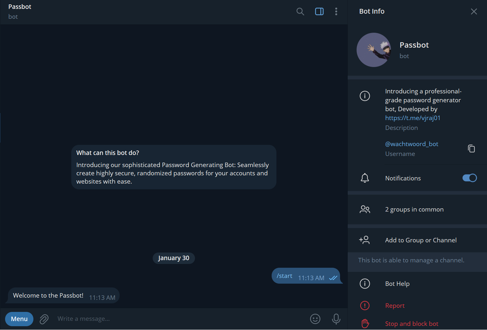

# Passbot 🗝️

 

**Description:**
Passbot is a Telegram bot designed to help users generate secure passwords of varying lengths quickly and easily. With Passbot, you can effortlessly create strong passwords tailored to your specific requirements, ensuring the safety of your online accounts and sensitive information.

**Features:**

1. **Password Generation:** Passbot allows users to generate passwords of different lengths by simply selecting the desired length from predefined options.
2. **User-Friendly Interface:** Passbot provides a user-friendly interface within the Telegram app, making it convenient for users to interact with the bot and generate passwords on the go.
3. **Help Menu:** Passbot offers a comprehensive help menu that provides users with information about available commands and how to use the bot effectively.
4. **Interactive Communication:** Passbot engages users through interactive communication, responding to greetings and farewells while maintaining a friendly and conversational tone.
5. **Security:** Passbot ensures the security of password generation by utilizing a reliable password generation API, guaranteeing the strength and randomness of the generated passwords.
6. **Customization:** Passbot allows users to select the length of passwords according to their specific requirements, offering flexibility and customization options.

**Commands:**

- **/start:** Initiate interaction with Passbot.
- **/help:** Access the help menu to learn about available commands and usage guidelines.
- **/password:** Initiate the password generation process and select the desired length from predefined options.

**Why Use Passbot?**

- **Secure Passwords:** Passbot helps users create strong and secure passwords, enhancing the overall security of their online accounts and sensitive data.
- **Convenience:** Passbot offers a convenient solution for generating passwords directly within the Telegram app, eliminating the need for external tools or applications.
- **User-Friendly:** Passbot features a user-friendly interface and intuitive commands, ensuring a seamless user experience for individuals of all technical backgrounds.

Experience the convenience and security of password generation with Passbot, your trusted companion for creating strong and reliable passwords on Telegram!

## Preview

| Description                                                    | Images                                           |
| -------------------------------------------------------------- | ------------------------------------------------ |
| 1. Go to our bot.                                              |       |
| 2. Click on `/start`.                                          |       |
| 3. Want to know the commands click `/help`.                    |       |
| 4. To generate password click `/password` generated.           |   |
| 4. Choose prefered `length`, Voila, Your `password` generated. |  |

## Thanks for Reading!
